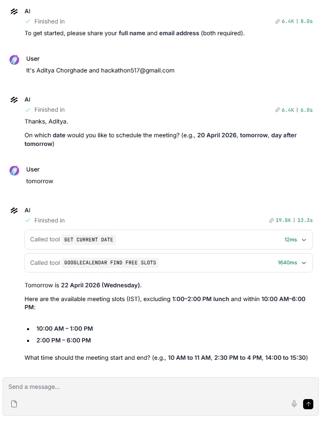
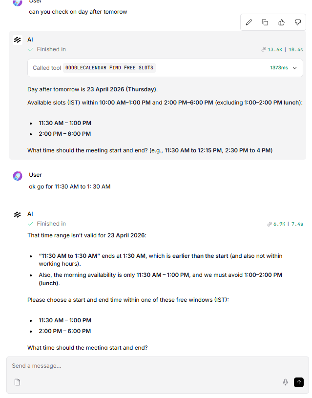
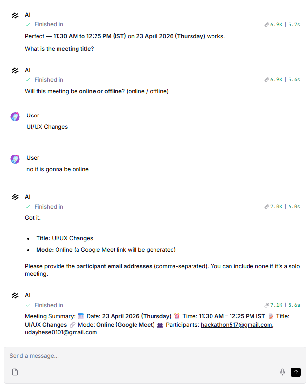
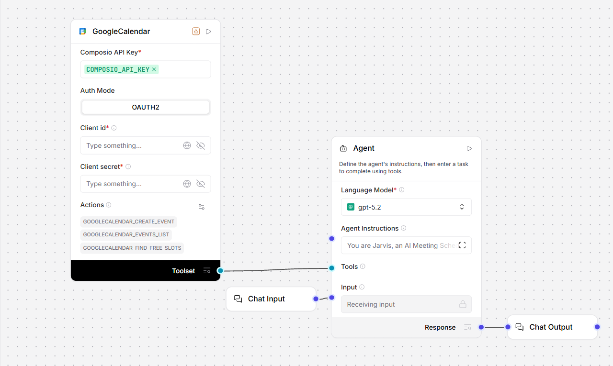

# 🤖 AI Meeting Scheduler Agent

An **Agentic AI-powered meeting scheduler** built using **LangFlow + LLM Agents + Google Calendar API**.  
Automates end-to-end meeting scheduling with intelligent validation, slot detection, and conversational interaction.

---

## 🚀 Features

- ✅ User Info Collection (Name + Email)
- 📅 Date Validation (natural language + weekend restriction)
- ⏰ Smart Slot Detection (Google Calendar integration)
- 🕒 Time Validation (no conflicts, min duration, working hours)
- 📧 Participant Email Validation
- 🧠 Conversational AI Workflow
- 🔗 Online (Google Meet) & Offline Meeting Support
- ✅ Confirmation before booking
- 📆 Automatic Event Creation with invites

---

## 🧠 Workflow

1. **User Info** → Collect name & email  
2. **Date Selection** → Validate date, reject weekends  
3. **Slot Detection** → Fetch + filter free slots (10 AM–6 PM, no lunch)  
4. **Time Selection** → Validate duration & conflicts  
5. **Meeting Details** → Title + mode (online/offline)  
6. **Participants** → Validate emails  
7. **Confirmation** → Show summary  
8. **Event Creation** → Create Google Calendar event  

---

## ⚙️ Validation Logic

### Time Validation
- Within **10:00 – 18:00**
- No overlap with **1–2 PM lunch**
- Minimum **15 minutes duration**
- Must fit available slots

### Email Validation
- Format: `name@domain.com`

---

## ❌ Error Handling

- Tool failure → retry message  
- No slots → choose another date  
- Invalid time → suggest valid slots  
- Invalid email → re-enter  

---

## 📂 Project Structure

```
AI-Meeting-Scheduler-Agent/
│── Images/
│   ├── Chat.png
│   ├── Chat2.png
│   ├── Chat3.png
│   ├── FlowDiagram.png
│
│── AI Meeting Assistant Scheduler.json
│── README.md
```

---

## 🖼️ Screenshots

### Chat Interaction




### Flow Diagram


---

## 📤 Exported Flow

```
AI Meeting Assistant Scheduler.json
```

- Import directly into **LangFlow**
- Contains full agent workflow + tool connections

---

## 🛠️ Tech Stack

- LangFlow  
- LLM Agents (GPT / OpenRouter)  
- Google Calendar API  
- OAuth 2.0  
- RAG + Tool Calling  

---

## ⭐ Key Highlights

- Agentic AI workflow  
- Real-time scheduling automation  
- Strong validation system  
- Conversational interface  

---

## 📎 How to Run

1. Import JSON into LangFlow  
2. Connect Google Calendar API  
3. Add API keys  
4. Run the agent  

---

## 👨‍💻 Author

**Uday Hese**  
Full-Stack & AI Developer
